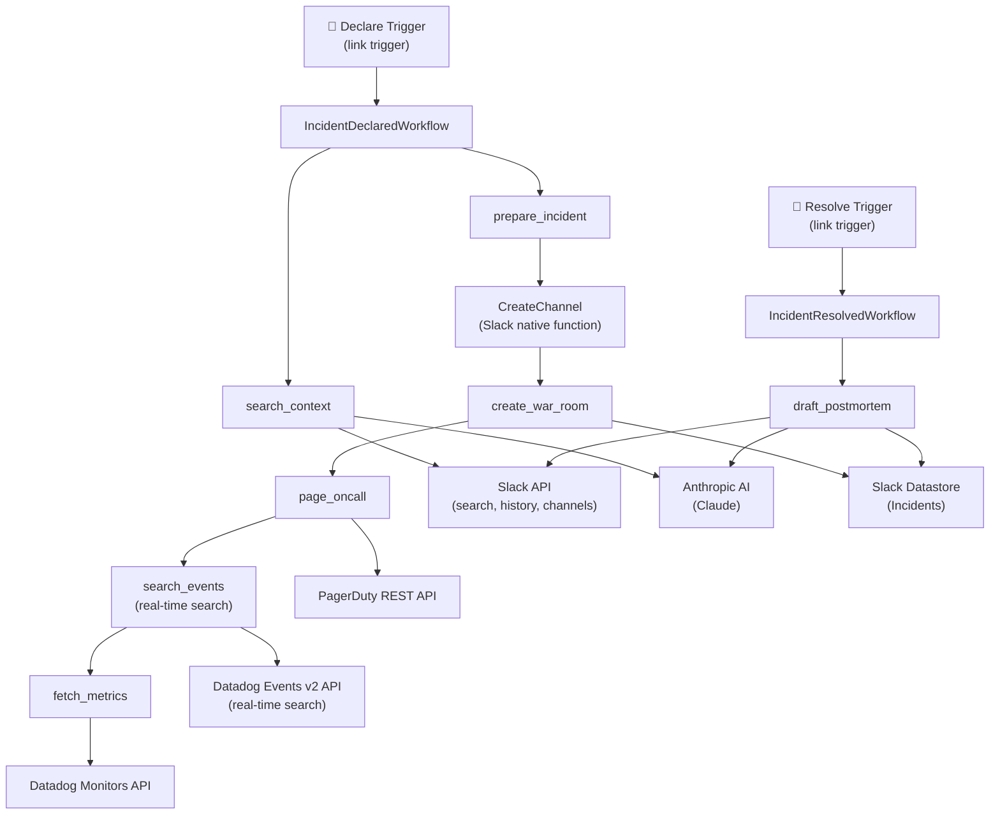

# Architecture

```mermaid
flowchart TD
    DT["🔗 Declare Trigger\n(link trigger)"]
    RT["🔗 Resolve Trigger\n(link trigger)"]

    DW["IncidentDeclaredWorkflow"]
    RW["IncidentResolvedWorkflow"]

    SC["search_context"]
    PI["prepare_incident"]
    CC["CreateChannel\n(Slack native function)"]
    WR["create_war_room"]
    PO["page_oncall"]
    SE["search_events\n(real-time search)"]
    FM["fetch_metrics"]
    DP["draft_postmortem"]

    SLACK_API["Slack API\n(search, history, channels)"]
    PD["PagerDuty REST API"]
    DD_EVENTS["Datadog Events v2 API\n(real-time search)"]
    DD["Datadog Monitors API"]
    AI["Anthropic AI\n(Claude)"]
    DS["Slack Datastore\n(Incidents)"]

    DT --> DW
    RT --> RW

    DW --> SC
    DW --> PI
    PI --> CC
    CC --> WR
    WR --> PO
    PO --> SE
    SE --> FM

    RW --> DP

    SC --> SLACK_API
    SC --> AI
    WR --> DS
    PO --> PD
    SE --> DD_EVENTS
    FM --> DD
    DP --> SLACK_API
    DP --> DS
    DP --> AI
```
